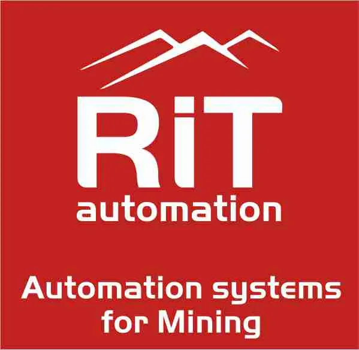
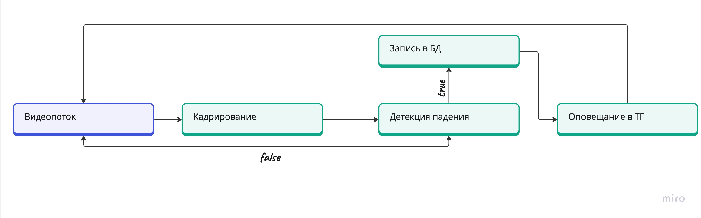
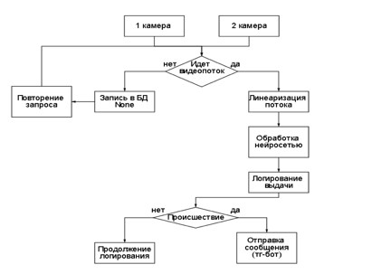
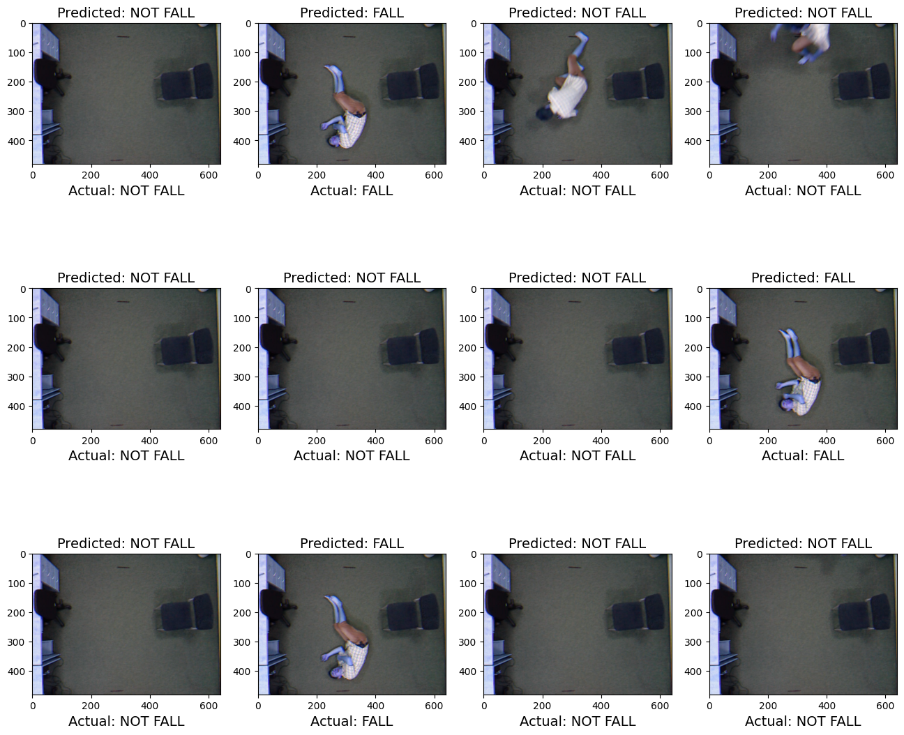
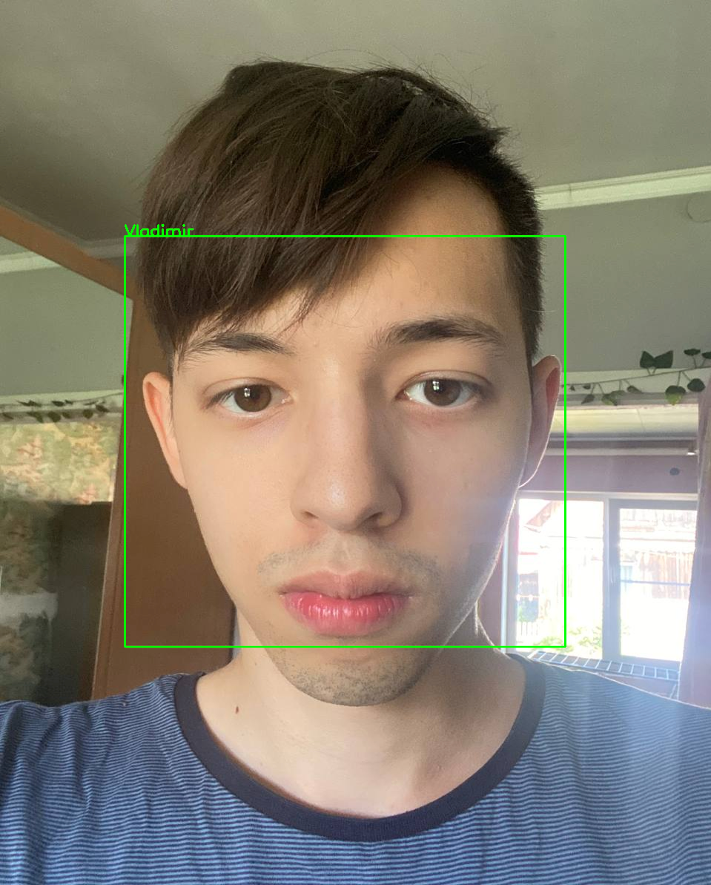
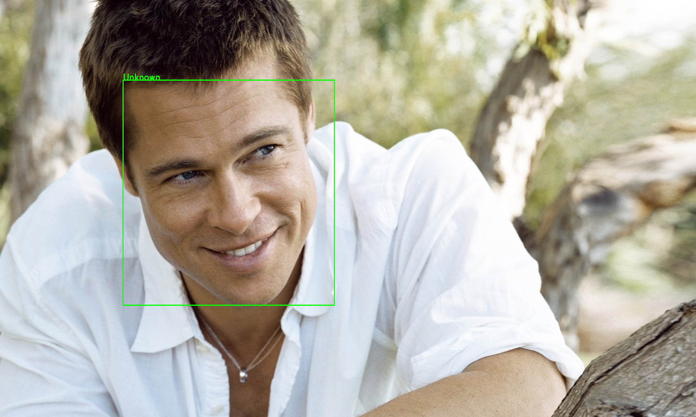

# CV_RIT

    

    
  
  
  
    

### Stack: 

https://github.com/Vladimir-Dimitrov-Ngu)

## Contents
- [RIT CV](#)
  - [Contents](#contents)
  - [Problem](#problem)
  - [Description](#description)
  - [Fall Detection](#fall-detection)
    - [Architecture](#Архитектура)
    - [Demo](#demo)
  - [Face Id](#face-id-)
    - [Demo](#demo)
  - [Future Roadmap](#future-roadmap)
  - [Contributing](#contributing)
  - [Conclusion](#conclusion)
  - [Authors](#authors)
## Problem
Данный продукт решает следующие проблемы:
* Автоматическая детекция пользователей
* Автоматическая детекция падений
* Быстрое оповещение в случае ЧП
## Description
Предлагаемая система видеонаблюдения предназначена для обеспечения комплексного мониторинга и обеспечения безопасности 
на всей выделенной территории. Она состоит из четырех камер высокого разрешения, каждая из которых оснащена 
специализированными датчиками для распознавания лиц, обнаружения СИЗ, мониторинга транспорта и обнаружения падений. 
Все собранные данные хранятся в централизованной базе данных для последующего анализа и извлечения.
## Fall Detection
[Оригинальная статья](https://www.researchgate.net/figure/Selected-frames-from-the-frontal-sequence-of-the-URFD-dataset_fig3_325726994)

[Подспорье](https://digitrain.ru/articles/10582/)

[Данные](http://fenix.ur.edu.pl/~mkepski/ds/uf.html)

### Архитектура
[MIRO](https://miro.com/app/board/uXjVNddzl3U=/?share_link_id=857149013220)

    

    

### Demo

    

## Face id
### Demo
#### True

    

#### False 

    

## Future  Roadmap
- [ ] Автоматическая детекция статусов с помощью систем видеонаблюдения
- [ ] Определение параметров бурения
- [ ] Детекция подвоза техники 
- [ ] Улучшить взаимодействие с пользователем

## Contributing
Copy of the [`contributing.md`]().

## Conclusion
Предлагаемая система видеонаблюдения создает комплексное решение для мониторинга и повышения безопасности в пределах отведенной зоны. 
Благодаря алгоритмам нейронных сетей, эффективному управлению данными и возможностям немедленного оповещения, он обеспечивает надежный 
инструмент для защиты как имущества, так и персонала.

[Презентация продукта](presentation/Видеоаналитика.pptx)

[Техническое описание](presentation/Техническое описание системы видеонаблюдения.docx)

## Authors
- [Vladimir Dimitrov](https://github.com/Vladimir-Dimitrov-Ngu)